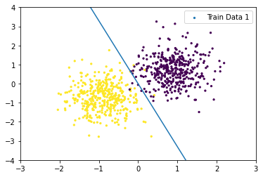
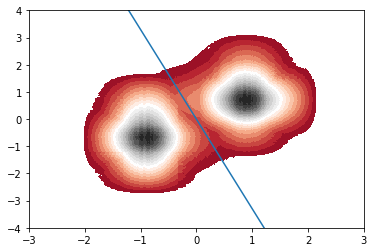
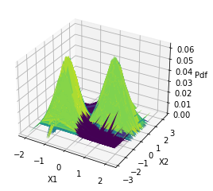
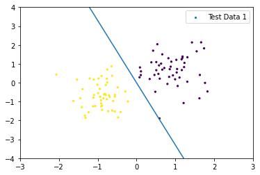
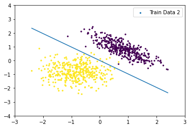
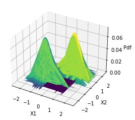
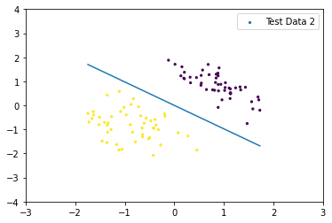

# Bayesian Classification: Gaussian Linear Discriminant Analysis (GLDA)

This project implements **Bayesian Classification**, specifically **Gaussian Linear Discriminant Analysis (GLDA)**, from scratch using Python. It demonstrates how to build a generative model, estimate class priors, means, and covariance matrices, and use Bayes' theorem to classify data points.


---

## 1. Mathematical Background

The classifier predicts the class $y$ for a given input feature vector $x$ by maximizing the posterior probability $P(y|x)$ using Bayes' Theorem:

$$
P(y=k | x) = \frac{P(x | y=k) \cdot P(y=k)}{P(x)}
$$

Since $P(x)$ is constant for all classes, the prediction rule is:

$$
\hat{y} = \underset{k}{\arg\max} \left( P(x | y=k) \cdot \phi_k \right)
$$

### 1.1 Model Parameters
The code implements the following parameter estimations (Maximum Likelihood Estimation):

1.  **Prior Probability ($\phi_k$)**: The probability of observing class $k$.
    $$\phi_k = \frac{1}{m} \sum_{i=1}^{m} 1\{y^{(i)} = k\}$$
    *(Variable in code: `fi`)*

2.  **Mean Vector ($\mu_k$)**: The center of the data for class $k$.
    $$\mu_k = \frac{\sum_{i=1}^{m} 1\{y^{(i)} = k\} x^{(i)}}{\sum_{i=1}^{m} 1\{y^{(i)} = k\}}$$
    *(Variable in code: `mu`)*

3.  **Covariance Matrix ($\Sigma$)**: Shared variance across all classes (Linear Discriminant).
    $$\Sigma = \frac{1}{m} \sum_{i=1}^{m} (x^{(i)} - \mu_{y^{(i)}})(x^{(i)} - \mu_{y^{(i)}})^T$$
    *(Variable in code: `cov`)*

### 1.2 Probability Density Function (Gaussian)
The likelihood $P(x|y=k)$ is calculated using the Multivariate Normal distribution:

$$P(x | y=k) = \frac{1}{(2\pi)^{d/2}|\Sigma|^{1/2}} \exp\left(-\frac{1}{2}(x-\mu_k)^T \Sigma^{-1} (x-\mu_k)\right)$$

---

## 2. Implementation Details

The project uses the following libraries:
* `numpy` & `scipy`: For matrix operations and sparse matrix handling.
* `pandas`: For data handling.
* `matplotlib`: For 2D and 3D plotting.
* `sklearn`: Used strictly for `train_test_split`, `preprocessing`, and `accuracy_score`.

### Key Functions
* `load_data(set_type)`: Loads CSV data and scales features (StandardScaler).
* `glda_learn(x, y, m, k)`: Computes $\phi$, $\mu$, and $\Sigma$.
* `predict(...)`: Calculates posterior probabilities and returns class predictions.
* `calc_decision_boundary(...)`: Derives the coefficients $a_1, a_2, b$ for the linear separator.

---

## 3. Results and Visualizations

The model was tested on two distinct datasets. Below are the generated plots showing the training data, decision boundaries, probability contours, and test results.

Here is a summary of the model's performance on both datasets:

| Dataset | Train Accuracy | Test Accuracy |
| :---: | :---: | :---: |
| **Dataset 1** | 0.95 | 0.92 |
| **Dataset 2** | 0.88 | 0.85 |

### Dataset 1
This dataset demonstrates the model's ability to separate two distinct clusters.

| Training Data | Decision Boundary |
| :---: | :---: |
|  |  |

**Probability Density:**
The contour plot below visualizes the Gaussian PDF calculated by the model.



**Test Set Evaluation:**


---

### Dataset 2
The second dataset tests the model on a different geometric distribution.

| Training Data | Decision Boundary |
| :---: | :---: |
|  |  |

**3D Visualization:**
A 3D surface plot of the Probability Density Function.



**Test Set Evaluation:**


---

## 4. How to Run

1.  Ensure you have the required libraries installed:
    ```bash
    pip install numpy scipy pandas matplotlib scikit-learn
    ```
2.  Place the data files (`BC-Train1.csv`, `BC-Test1.csv`, etc.) in the root directory.
3.  Run the notebook or script. The `GLDA()` function will execute the training and plotting pipeline.

---

### 👤 Author: Zahra Amini

 [GitHub](https://github.com/aminizahra)

 [Portfolio](https://aminizahra.github.io/)

 [LinkedIn](https://www.linkedin.com/in/zahraamini-ai/)
