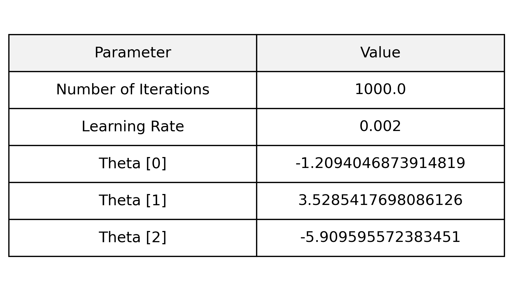
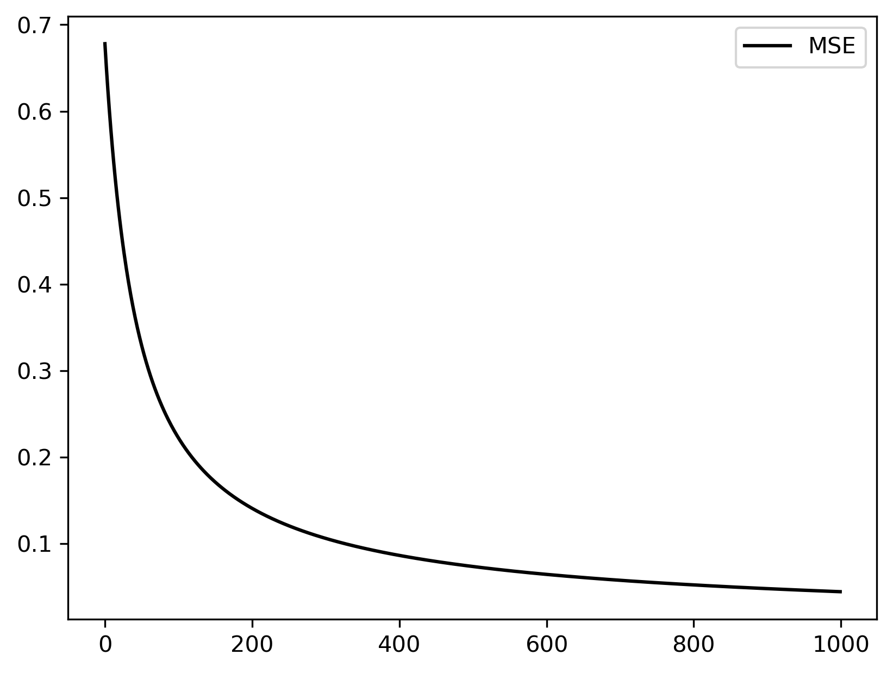
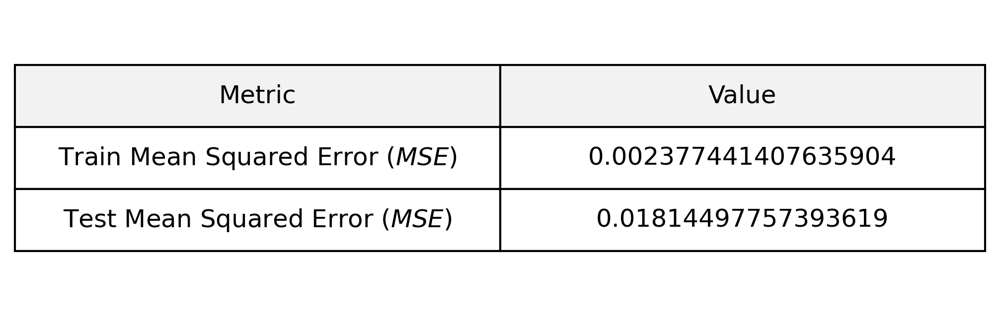

# Binary Classification: Logistic Regression on Iris Data

A from-scratch implementation of **Logistic Regression** to perform binary classification on the Iris dataset. This project demonstrates the construction of a probabilistic model, optimization via **Gradient Descent**, and the calculation of a linear Decision Boundary.


## 📌 Overview

The objective of this project is to classify data points into two distinct classes (0 and 1) based on two input features ($x_1$ and $x_2$). Unlike Linear Regression, which outputs continuous values, this model outputs a probability between 0 and 1 using the Sigmoid function.

### Project Highlights
* **Vectorized Implementation:** Uses NumPy for efficient matrix operations.
* **Gradient Descent:** Iteratively optimizes weights ($\theta$) to minimize error.
* **Decision Boundary:** Mathematically derives and plots the separating line.
* **Performance Tracking:** Monitors the Cost (Log-Loss) and calculates MSE.

---

## 🧮 Mathematical Formulation

### 1. The Sigmoid Activation
To map our predictions to a probability range $(0 \leq h_\theta(x) \leq 1)$, we apply the Sigmoid function to the linear combination of weights and inputs:

$$h_\theta(x) = \frac{1}{1 + e^{-(\theta_0 + \theta_1 x_1 + \theta_2 x_2)}}$$

### 2. Cost Function (Log-Loss)
To train the model, we minimize the Binary Cross-Entropy (Log-Loss) function. This function penalizes confident wrong predictions heavily:

$$J(\theta) = -\frac{1}{m} \sum_{i=1}^{m} \left[ y^{(i)}\log(h_\theta(x^{(i)})) + (1-y^{(i)})\log(1-h_\theta(x^{(i)})) \right]$$

### 3. Gradient Descent Optimization
The weights are updated iteratively using the gradient of the cost function:

$$\theta_j := \theta_j - \alpha \frac{1}{m} \sum_{i=1}^{m} (h_\theta(x^{(i)}) - y^{(i)})x_j^{(i)}$$

* **Learning Rate ($\alpha$):** 0.002
* **Iterations:** 1000

### 4. Decision Boundary
The boundary between the two classes is where the probability $h_\theta(x) = 0.5$, which implies $\theta^T x = 0$. Solving for $x_2$ allows us to plot the line:

$$x_2 = \frac{-(\theta_0 + \theta_1 x_1)}{\theta_2}$$

---

## 📊 Model Training & Results

### Learned Parameters
After running the optimization loop for 1000 iterations, the model converged to the following weights ($\theta$):



### Visualization: Decision Boundary
The following plots show the dataset with the calculated decision boundary (the blue line). Points on one side are classified as 0, and points on the other as 1.

| **Training Set** | **Test Set** |
|:---:|:---:|
|  |  |
| *Figure 1: The model fitting the training data.* | *Figure 2: The model generalizing to unseen test data.* |

---

## 📈 Performance Metrics

### Cost Function Convergence
The graph below shows the value of the Cost Function (MSE/Log-Loss) decreasing over 1000 iterations. The smooth curve indicates a stable learning rate.



### Final Error Rates
While the model optimizes Log-Loss, we also calculated the Mean Squared Error (MSE) for evaluation:



---

## 🛠️ Usage

### Prerequisites
* Python 3.x
* NumPy
* Pandas
* Matplotlib

### Installation
1.  Clone the repository:
    ```bash
    git clone [https://github.com/aminizahra/Pattern-recognition.git](https://github.com/aminizahra/Pattern-recognition.git)
    ```
2.  Navigate to the folder:
    ```bash
    cd "Binary Classification Logistic regression"
    ```
3.  Ensure your data files (`iris-Train.data`, `iris-Test.data`) are in the root directory.
4.  Run the notebook or script.

---

### 👤 Author: Zahra Amini

 [GitHub](https://github.com/aminizahra)

 [Portfolio](https://aminizahra.github.io/)

 [LinkedIn](https://www.linkedin.com/in/zahraamini-ai/)
