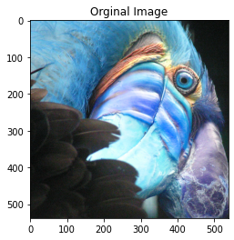
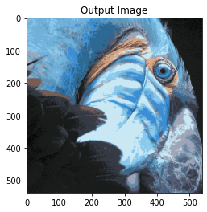

# K-Means Clustering for Image Compression

This project demonstrates the application of the **K-Means Clustering** algorithm to compress images by reducing the number of colors in the visual palette. By grouping similar pixel intensities and replacing them with cluster centroids, we achieve significant data reduction while preserving the primary features of the image.


## 📌 Project Overview

In a digital image, each pixel typically represents a color using a specific bit-depth. For a grayscale image, this is usually 8 bits (256 levels). For RGB, it is 24 bits. 

**K-Means Clustering** treats each pixel as a data point in a multi-dimensional space. By clustering these points into $K$ groups, we can represent the entire image using only $K$ colors. This process is known as **Vector Quantization**.

### Key Features
* Implementation of the K-Means algorithm from scratch/using optimized libraries.
* Flattening and normalization of image data for clustering.
* Color quantization to $K$ distinct levels.
* Visual comparison between original and compressed results.

---

## 🧮 Mathematical Formulation

### 1. Objective Function (Inertia)
The goal of the K-Means algorithm is to minimize the **Within-Cluster Sum of Squares (WCSS)**, also known as the Distortion Function:

$$J = \sum_{i=1}^{n} \sum_{j=1}^{K} w_{ij} \| x^{(i)} - \mu_j \|^2$$

Where:
* $n$ is the total number of pixels.
* $K$ is the number of clusters (colors).
* $x^{(i)}$ is the vector representing the $i^{th}$ pixel.
* $\mu_j$ is the centroid of cluster $j$.
* $w_{ij}$ is a binary indicator ($1$ if $x^{(i)}$ belongs to cluster $j$, else $0$).

### 2. The Iterative Process
The algorithm follows two main steps until convergence:

**A. Expectation (Assignment):** Assign each pixel to the nearest centroid.
$$c^{(i)} := \arg\min_{j} \| x^{(i)} - \mu_j \|^2$$

**B. Maximization (Update):** Update the centroid of each cluster to be the mean of the assigned pixels.
$$\mu_j := \frac{\sum_{i=1}^{n} \mathbb{1}\{c^{(i)} = j\} x^{(i)}}{\sum_{i=1}^{n} \mathbb{1}\{c^{(i)} = j\}}$$

---

## 📊 Results

The following images illustrate the transition from the original high-resolution input to the compressed output after applying K-Means.

### Original Image
The starting point is the high-fidelity source file:


### Comparison: Input vs. Compressed
By applying K-Means, we reduce the complexity of the pixel distribution. This is clearly visible when comparing the grayscale representations:

| Original Grayscale Input | Compressed Output (K-Means) |
| :---: | :---: |
|  |  |
| *Original pixel intensities* | *Quantized into $K$ clusters* |

---

## 🛠️ Installation & Usage

### Prerequisites
Ensure you have the following Python libraries installed:
```bash
pip install numpy matplotlib pillow
```
### Running the Notebook
1. Clone the repository and navigate to the project folder.
2. Launch Jupyter Notebook:
```bash
jupyter notebook "hw5-kmeans.ipynb"
```
3. Run the cells to process bird.tiff and generate the compressed outputs.

---

### 👤 Author: Zahra Amini

 [GitHub](https://github.com/aminizahra)

 [Portfolio](https://aminizahra.github.io/)

 [LinkedIn](https://www.linkedin.com/in/zahraamini-ai/)
