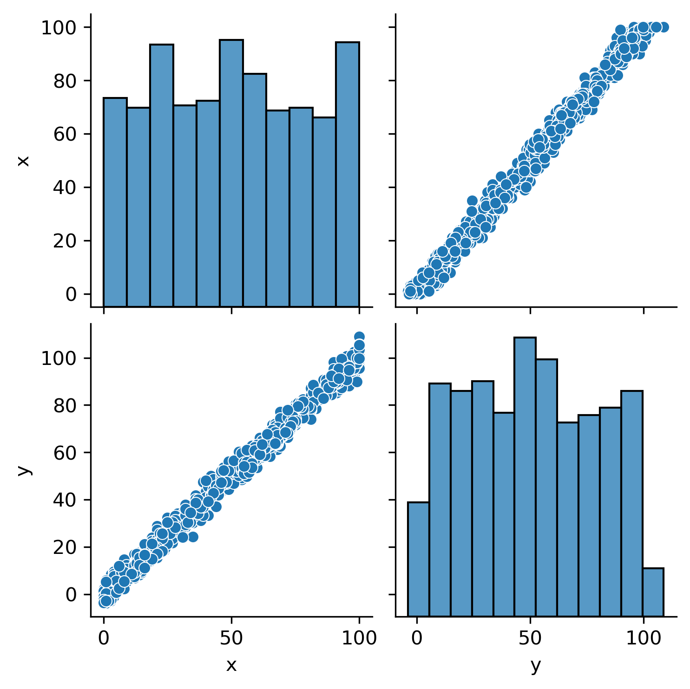
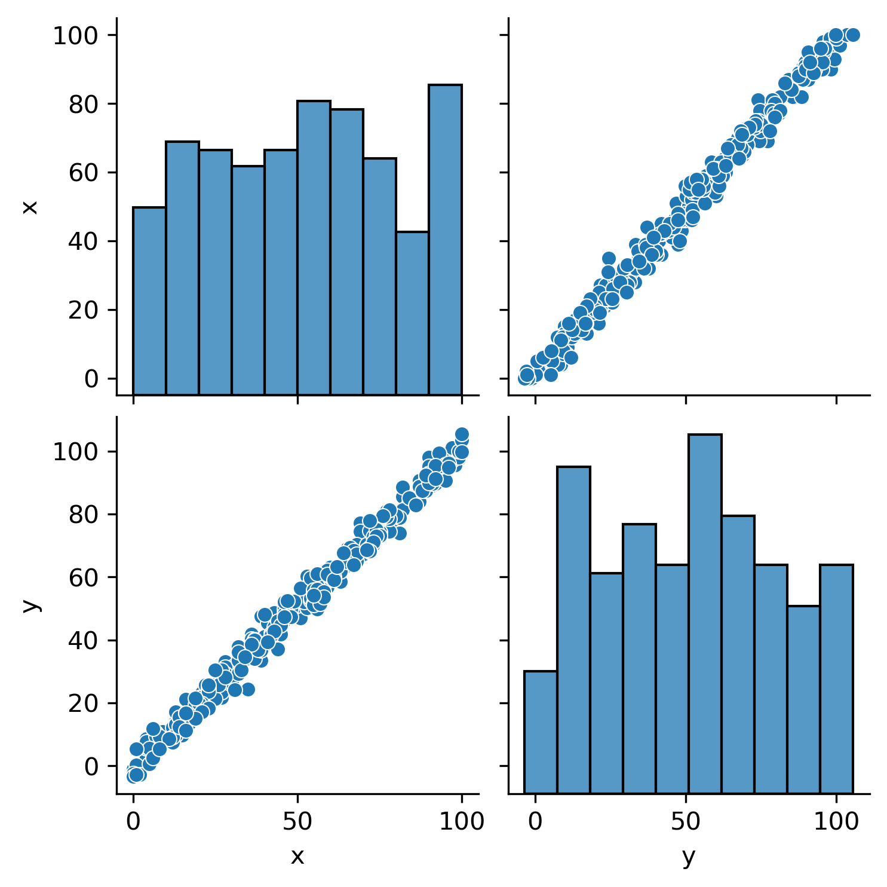
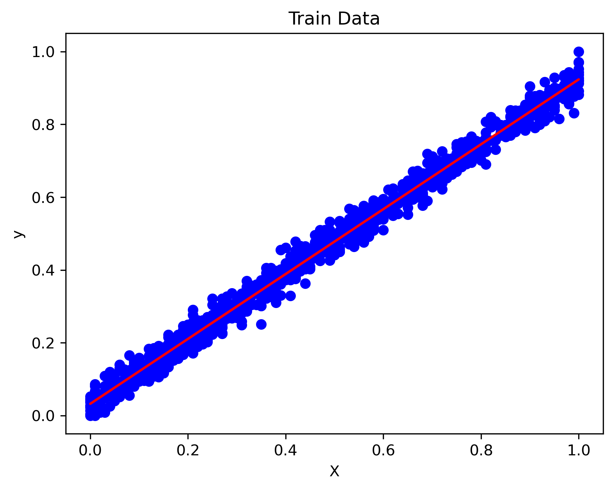
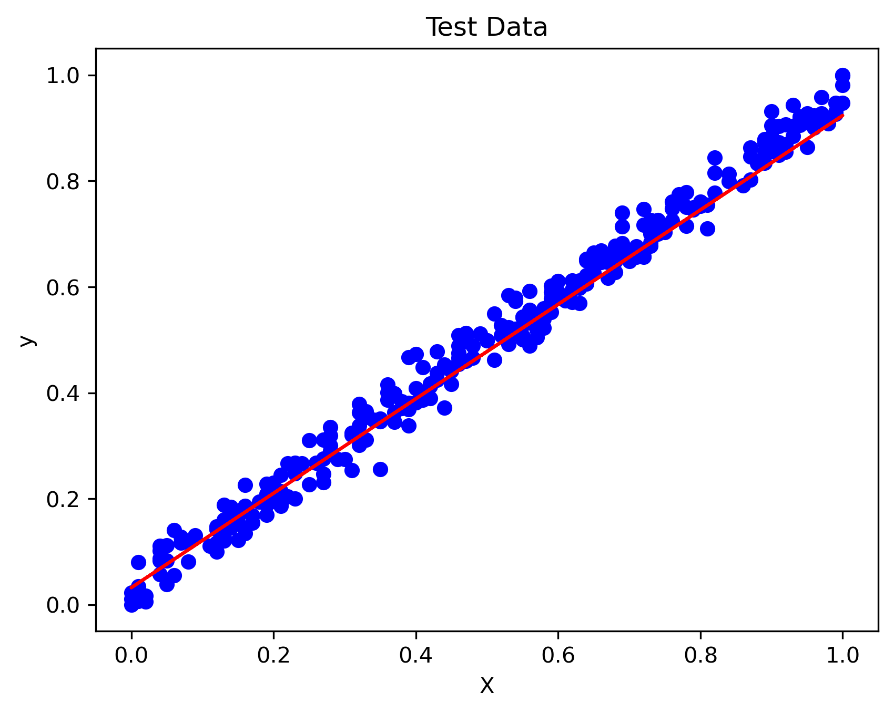

# Linear Regression via Closed-Form Solution (Normal Equation)

This project implements a **Linear Regression** model from scratch using the **Closed-Form Solution** (also known as the Normal Equation). Unlike iterative methods like Gradient Descent, this approach finds the optimal parameters analytically in a single step.

## 📌 Project Overview
The goal is to predict a continuous target variable based on input features by minimizing the Sum of Squared Errors (SSE). This implementation covers:
* Data Preprocessing & Normalization.
* Exploratory Data Analysis (EDA) with Pairplots and Heatmaps.
* Mathematical implementation of the Normal Equation.
* Model evaluation on Train and Test sets.

## ⚖️ The Mathematical Approach

The Linear Regression model is represented as:
$$y = X\theta + \epsilon$$

To find the optimal vector $\theta$ that minimizes the cost function without iteration, we use the **Normal Equation**:

$$\theta = (X^T X)^{-1} X^T y$$

Where:
* $\theta$: Weights/Parameters of the model.
* $X$: Matrix of input features (with a bias column).
* $y$: Target vector.

---

## 📊 Visual Exploration (EDA)

Before training, we analyze the relationship between variables and the distribution of the data.

### 1. Correlation Analysis
The heatmap helps identify the strength of relationships between features.

### 2. Feature Distributions
Pairplots for both training and testing datasets ensure that the data split maintains consistent distributions.
| Training Set | Test Set |
|--------------|----------|
|  |  |

---

## 🚀 Model Performance

After computing the weights using the closed-form matrix operations, the model's predictions were compared against the actual values.

### Regression Results (Train vs Test)
The following plots show the predicted values (red line) against the actual data points (blue dots).

**Training Performance:**

**Testing Performance:**

---

## 🛠️ Requirements
To run the notebook, you need the following libraries:
* `numpy`
* `pandas`
* `matplotlib`
* `seaborn`

## 📂 File Structure
* `linear-regression-closed-form.ipynb`: The main Jupyter notebook containing the implementation.
* `*.png`: Visualization results and plots.

## 📝 Conclusion
The Closed-Form solution provides an efficient way to solve Linear Regression for datasets where the number of features is relatively small, as it avoids the complexity of tuning learning rates or choosing the number of iterations.
