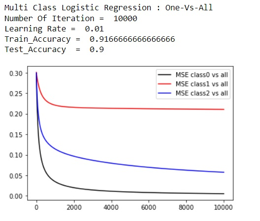
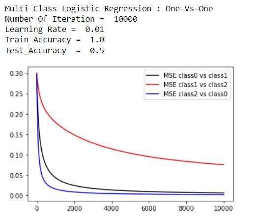
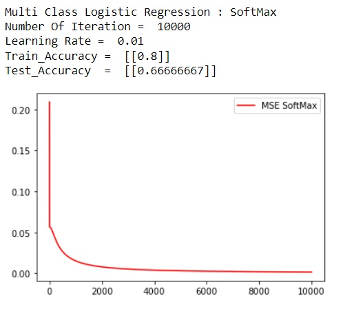

# Multiclass Classification: Softmax Logistic Regression

A comprehensive implementation of **Multiclass Logistic Regression** using the **Softmax** function, alongside comparisons with **One-vs-All (OvA)** and **One-vs-One (OvO)** strategies. This project explores how linear models can be extended to classify multiple categories effectively.


## 📌 Overview

While standard Logistic Regression is designed for binary classification, multiclass problems require a different approach. This project implements:

1.  **Softmax Regression (Multinomial Logistic Regression):** A generalization of logistic regression that predicts a probability distribution over $K$ classes.
2.  **One-vs-All (OvA):** Training $K$ separate binary classifiers.
3.  **One-vs-One (OvO):** Training $K(K-1)/2$ binary classifiers for every possible pair of classes.

### Key Features
* **Vectorized Implementation** using NumPy for efficient computation.
* **Softmax Activation** to handle multi-category probability outputs.
* **Comparative Analysis** of accuracy and loss across different multiclass strategies.
* **Evaluation Metrics** including training and testing accuracy.

---

## 🧮 Mathematical Formulation

### 1. The Softmax Function
To map the linear outputs (logits) to probabilities that sum to 1, we use the Softmax function for each class $k$:

$$P(y=k | x) = \frac{e^{z_k}}{\sum_{j=1}^{K} e^{z_j}}$$

Where $z = W^T x + b$ represents the linear scores for each class.

### 2. Hypothesis Function
The model predicts the class with the highest probability:

$$\hat{y} = \arg\max_{k \in \{1, \dots, K\}} P(y=k | x)$$

### 3. Cross-Entropy Loss Function
To optimize the model, we minimize the negative log-likelihood (Cross-Entropy Loss):

$$J(W) = -\frac{1}{m} \sum_{i=1}^{m} \sum_{k=1}^{K} \mathbb{1}\{y^{(i)} = k\} \log \left( \frac{e^{W_k^T x^{(i)}}}{\sum_{j=1}^{K} e^{W_j^T x^{(i)}}} \right)$$

---

## 📊 Results & Visualizations

The following plots demonstrate the performance and decision boundaries/loss curves for the three different strategies implemented in the notebook.

### 1. One-vs-All (OvA) Performance


*Figure 1: Accuracy/Loss evolution using the One-vs-All strategy.*

### 2. One-vs-One (OvO) Performance


*Figure 2: Accuracy/Loss evolution using the One-vs-One strategy.*

### 3. Softmax Regression (Multinomial)


*Figure 3: Convergence and performance of the Softmax Logistic Regression model.*

---

## 🛠️ Installation & Usage

### Prerequisites
Ensure you have the following libraries installed:
```bash
pip install numpy matplotlib pandas scikit-learn
```

### Running the Project
1. Clone the repository.

2. Navigate to the project folder.

3. Open and run the Jupyter Notebook:

```bash
jupyter notebook "LogisticRegression (Prart 2(B)).ipynb"
```
---

### 👤 Author: Zahra Amini

 [GitHub](https://github.com/aminizahra)

 [Portfolio](https://aminizahra.github.io/)

 [LinkedIn](https://www.linkedin.com/in/zahraamini-ai/)
