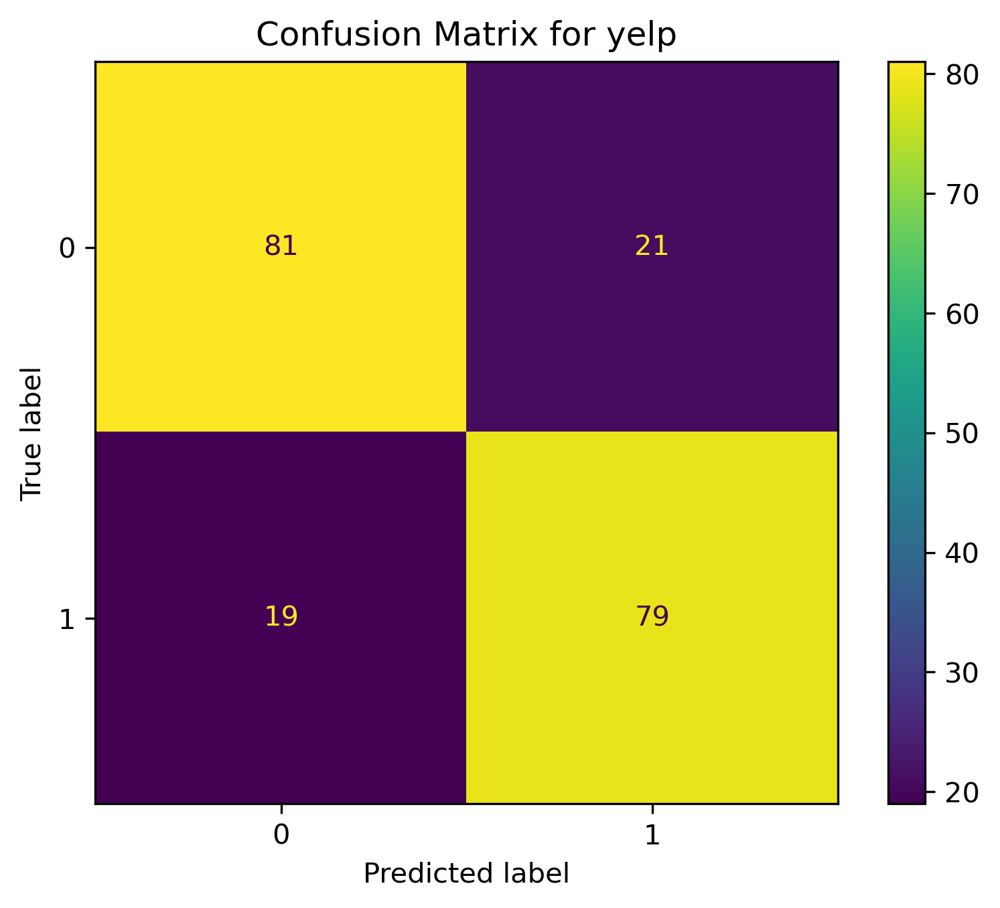
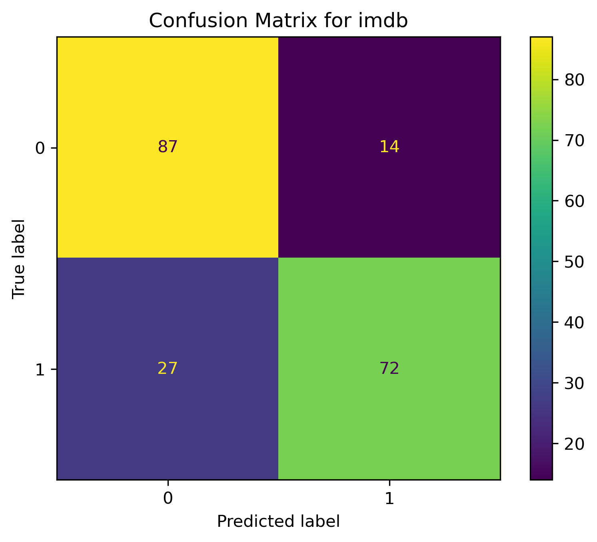
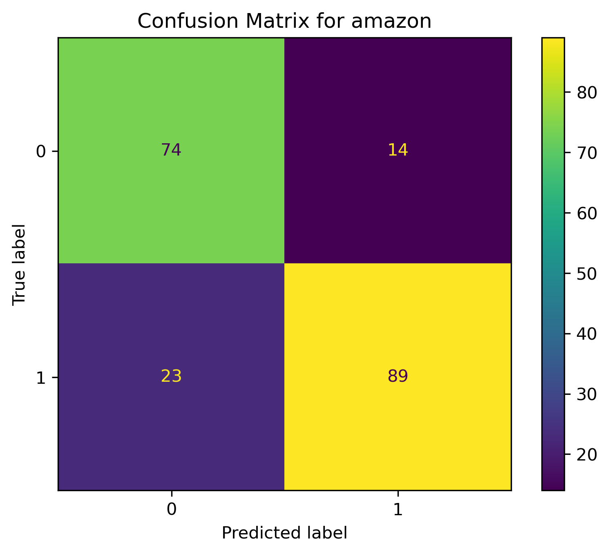
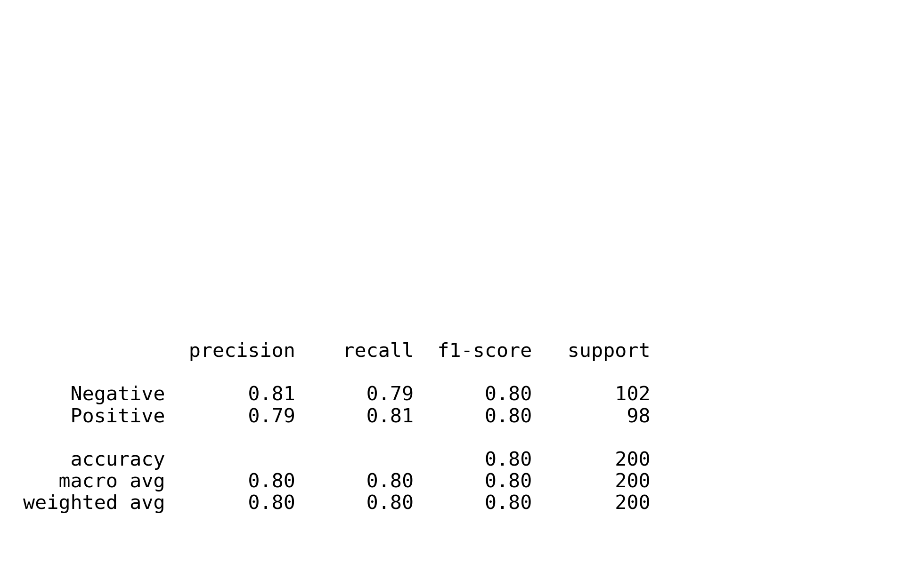
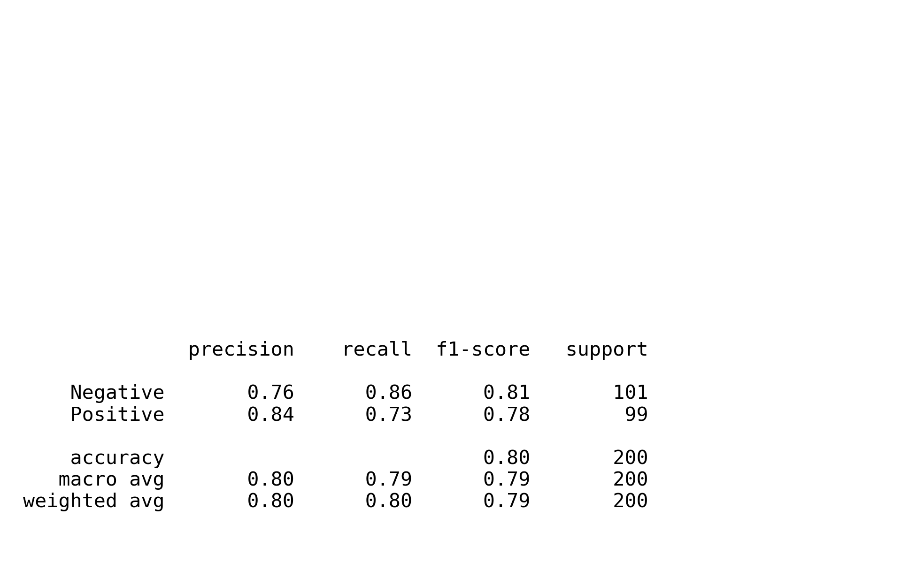

# Naïve Bayes Classification: Sentiment Analysis

This project implements a **Naïve Bayes Classifier** from scratch to perform sentiment analysis on text datasets (Yelp, IMDB, and Amazon). It demonstrates the power of probabilistic modeling in Natural Language Processing (NLP), specifically focusing on how word frequencies can predict text categories.


## 📌 Overview

The Naïve Bayes algorithm is based on Bayes' Theorem with the "naïve" assumption of conditional independence between every pair of features given the value of the class variable. In text classification, this means we assume the presence of one word in a sentence is unrelated to the presence of any other word.

### Key Features
* **Custom Text Tokenization:** Using `RegexpTokenizer` for clean feature extraction.
* **Bag of Words Model:** Representing text as frequency counts.
* **Laplace Smoothing:** Implemented to handle the "Zero Frequency" problem for words not present in the training vocabulary.
* **Multi-Dataset Evaluation:** Testing across various review platforms.

---

## 🧮 Mathematical Formulation

### 1. Bayes' Theorem for Classification
For a given document $d$ and a class $c$:

$$P(c|d) = \frac{P(c)P(d|c)}{P(d)}$$

Since $P(d)$ is constant for all classes, we maximize the numerator:

$$P(c|d) \propto P(c) \prod_{i=1}^{n} P(w_i|c)$$

Where $w_i$ are the individual words in the document.

### 2. Laplace Smoothing
To ensure that a single unseen word doesn't result in a total probability of zero, we apply smoothing:

$$\hat{P}(w_i | c) = \frac{count(w_i, c) + 1}{count(c) + |V|}$$

Where:
* $count(w_i, c)$: Number of times word $w_i$ appears in class $c$.
* $|V|$: Total number of unique words in the training vocabulary.

---

## 📊 Results & Evaluation

The following visualizations represent the model's performance across three distinct review datasets.

### 1. Confusion Matrices
These matrices illustrate the model's ability to distinguish between positive and negative sentiments.

| Yelp Dataset | IMDB Dataset | Amazon Dataset |
| :---: | :---: | :---: |
|  |  |  |

### 2. Classification Reports (F1-Score)
The reports below detail the **Precision, Recall, and F1-Score**, providing a deep dive into the model's accuracy per class.
| Yelp Dataset | IMDB Dataset | Amazon Dataset |
| :---: | :---: | :---: |
|  |  |  |
| *Figure 1: Detailed classification metrics for the Yelp Dataset.* | *Figure 2: Detailed classification metrics for the imdb Dataset.* | *Figure 2: Detailed classification metrics for the amazon Dataset.* |

---

## 🛠️ Installation & Usage

### Prerequisites
Install the required dependencies:
```bash
pip install numpy matplotlib nltk scikit-learn pandas
```
### Running the Notebook
1. Clone the repository.

2. Ensure your datasets are in the correct directory.

3. Open and run the Jupyter Notebook:

```bash
jupyter notebook NaiveBayes.ipynb
```
---

### 👤 Author: Zahra Amini

 [GitHub](https://github.com/aminizahra)

 [Portfolio](https://aminizahra.github.io/)

 [LinkedIn](https://www.linkedin.com/in/zahraamini-ai/)
